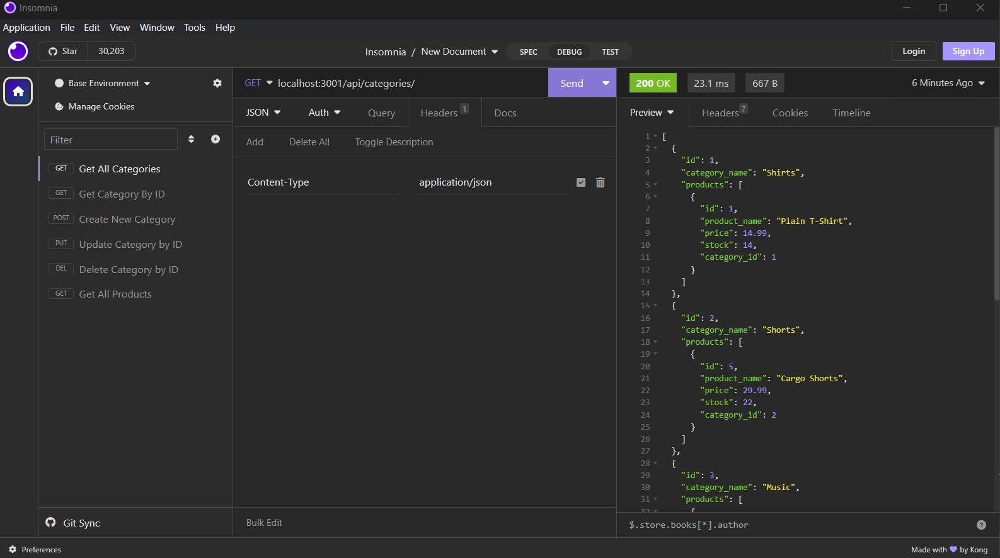

# C13-ORMBACKEND
Challenge 13 - Boot Camp

[](https://opensource.org/licenses/MIT)


## Table of Contents

  1. [Description of Assignment](#description-of-assignment)
  2. [About](#about)
      1. [User Story](#user-story)
      2. [Acceptance criteria](#acceptance-criteria)
  3. [Screenshots](#screenshots)    
  3. [Walkthrough Videos](#walkthrough-videos)
  4. [License](#license)
  5. [Contact](#contact)
  6. [Final Work Review](#final-work-review)


  ## Description of Assignment

Internet retail, also known as e-commerce, is the largest sector of the electronics industry, having generated an estimated US$29 trillion in 2017 (Source: United Nations Conference on Trade and Development). E-commerce platforms like Shopify and WooCommerce provide a suite of services to businesses of all sizes. Due to the prevalence of these platforms, developers should understand the fundamental architecture of e-commerce sites.

Your challenge is to build the back end for an e-commerce site. You’ll take a working Express.js API and configure it to use Sequelize to interact with a MySQL database.

  ## About 

---
### User Story

```
AS A manager at an internet retail company
I WANT a back end for my e-commerce website that uses the latest technologies
SO THAT my company can compete with other e-commerce companies

```
### Acceptance Criteria

```
GIVEN a functional Express.js API
WHEN I add my database name, MySQL username, and MySQL password to an environment variable file
THEN I am able to connect to a database using Sequelize
WHEN I enter schema and seed commands
THEN a development database is created and is seeded with test data
WHEN I enter the command to invoke the application
THEN my server is started and the Sequelize models are synced to the MySQL database
WHEN I open API GET routes in Insomnia Core for categories, products, or tags
THEN the data for each of these routes is displayed in a formatted JSON
WHEN I test API POST, PUT, and DELETE routes in Insomnia Core
THEN I am able to successfully create, update, and delete data in my database
```

## Screenshots




## Walkthrough Videos

https://drive.google.com/file/d/15jAIORBKqR6a2ma3NltqD5kz5ZxpCkZk

## License

License used for this project - MIT
  * For more information on license types, please reference this website
  for additional licensing information: [https: //choosealicense.com/](https://choosealicense.com/).


  ## Contact

  * GitHub Username: [SMarquis85](https://github.com/SMarquis85)
  * Email: sophienathalie_85@outlook.com


  ## Final Work Review

**"Always leave the code a little cleaner than when you found it."**  This action was applied to ALL JAVASCRIPT files. To create this assignment, I used Lawrence Wilson's Audiobook, Cathy Tanimura's book on SQL. References we're found on Google, multiple websites including W3Schools, DEV, GitHub, Insomnia and Tutorialspoint. YouTube was helpful as well as all ZOOM recordings (of previous classes). Looks much cleaner, organised and easier to find what you are looking for. I also received the help of my second tutor, Erik Hoversten. He helped clean up my code, demonstrate how to use Insomnia and fix multiple errors I have encountered while building this database. 

> **(CARL-VIRT-FSF-PT-04-2023, Challenge 13 / README.md 2023)**

> **(JavaScript Full Stack Developers, Lawrence Wilson; Audiobook (2023) 6hrs and 29mins. )**

> **(SQL for Data Analysis: Advanced Techniques for Transforming Data into Insights, Cathy Tanimura; 1st edition (Oct. 19th 2021) 357 pages.)** 


## Github Repository Link:

https://github.com/SMarquis85/C13-ORMBACKEND